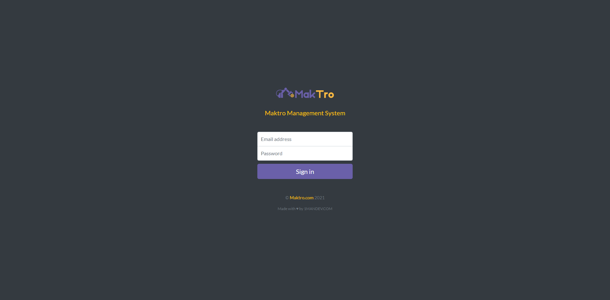
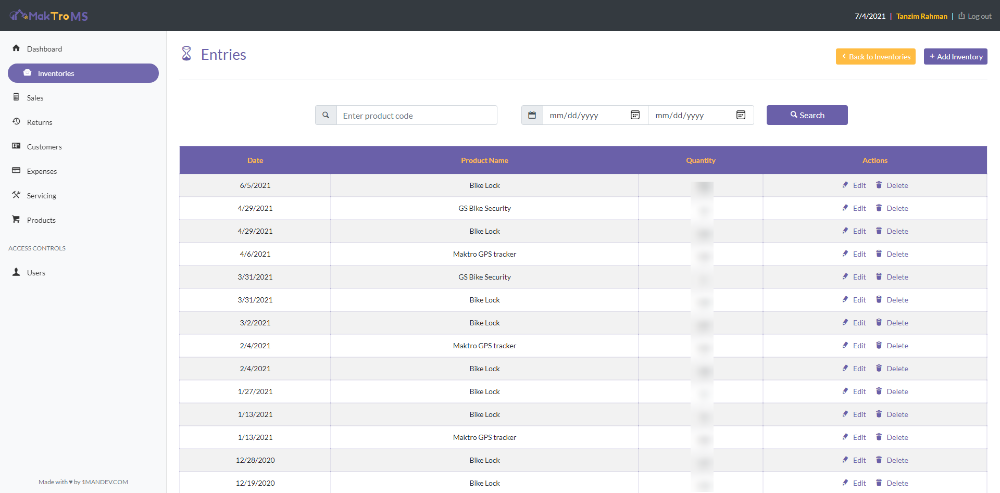
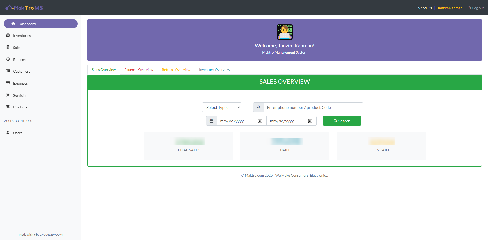
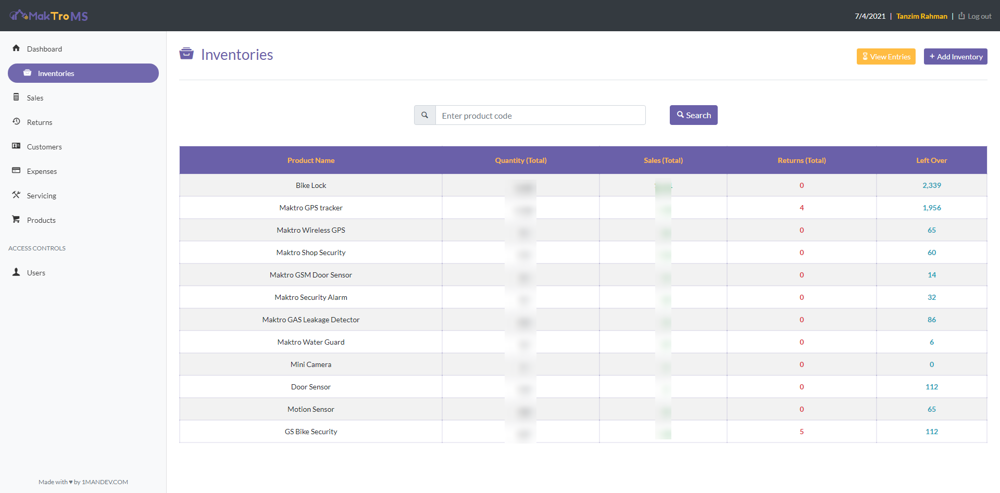
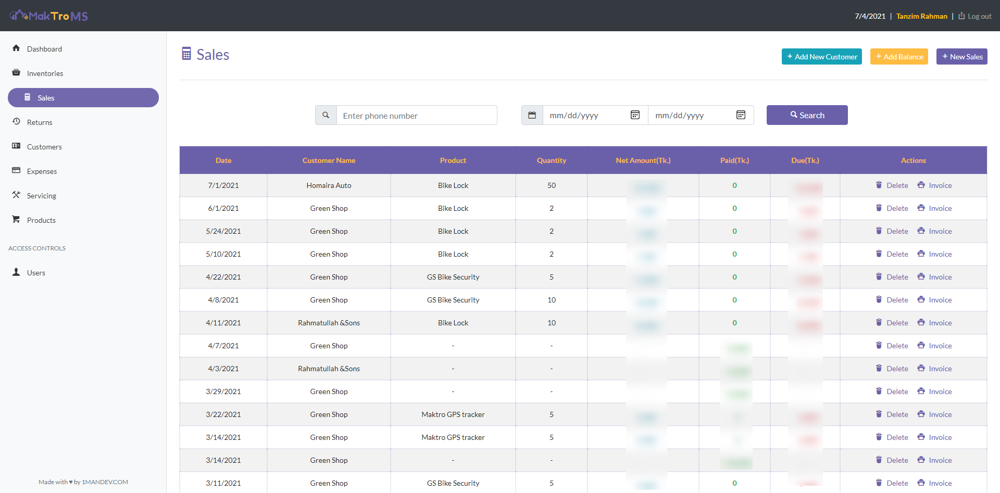
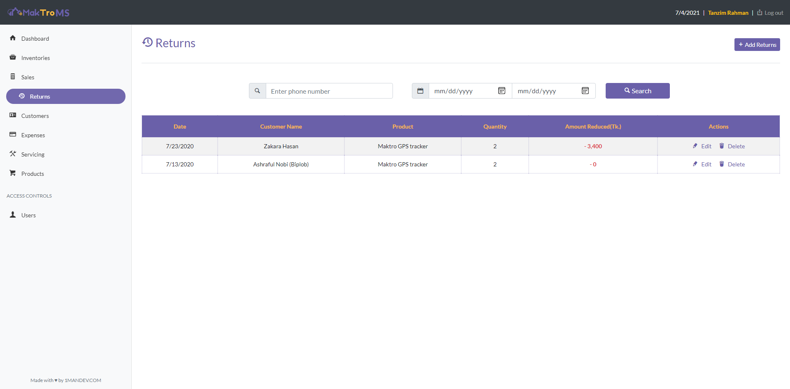
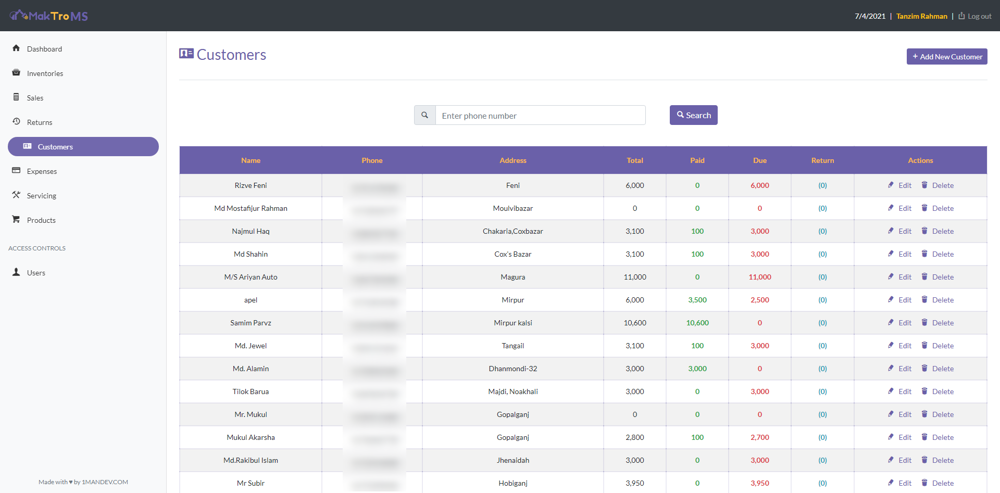
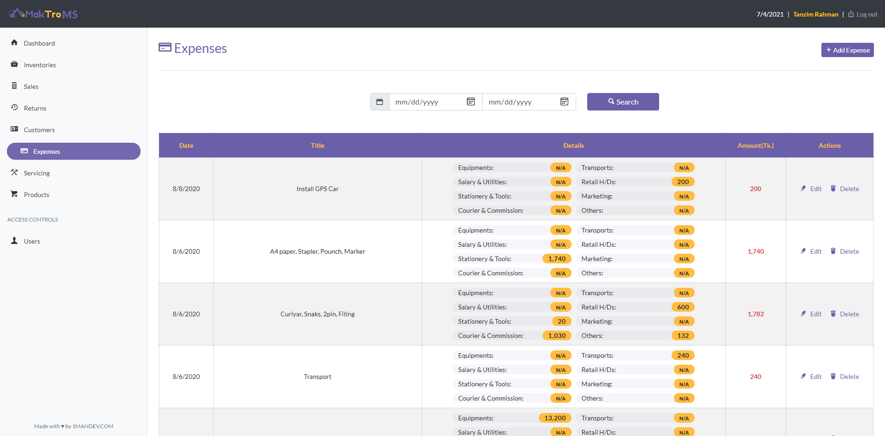
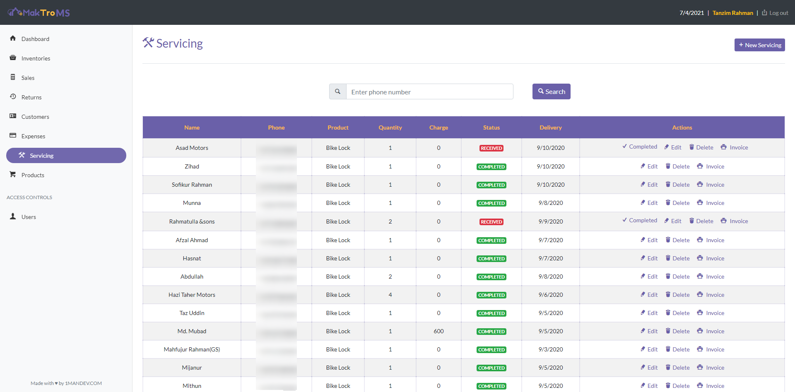
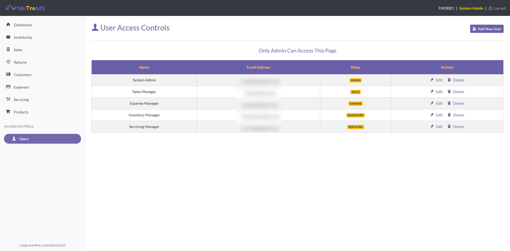

<h1 align="center">
  
  
Management System

</h1>

A business business management (inventory, sales, expense and servicing) system which is primarily built for Maktro.com. This project is crafted with Nodejs, Express, Ejs and MongoDB (using Mongoose ODM).

## Features Highlight

This application has lots of features including sales, expenses, returns, servicing and many more. There are lots of common features like pagination, searching, api for reading data for auto-completion on the form fields, PDF generations on sales or servicing, along with below features:

- Users: You can create 5 types of users based on the roles and permission - Admin, Sales, Inventory, Expense, and Servicing Manager. Although admin has all abilities to do anything but other users have limited accessibility by intentions.
- Products: You can create as many products as you want. Later on this product information will be used everywhere.
- Inventory: List of Products with Inventory overview - Total, sales and left over.
  - Entry: You can add, edit and delete product to inventory.
- Customer: List of customers with balances. You can add, edit and delete customer information. With any particular sales or returns the customer balance will automatically syncs.
- Sales: You can add sales and delete them. And Balance to the customer account without sales to clear previous due. This will automatically generate PDF invoice, and auto syncs with all the previous sales and dues for customer balance and also syncs with inventory status.
- Return: You add, edit and delete any returns of a product. Syncs with customer balance and with inventory status.
- Servicing: You add, edit and delete any servicing of a product. This, also generates invoice. You can quickly change the status of servicing. This changes also reflects on the PDF invoice.
- Expenses: You add, edit and delete any expenses by the number of categories.
- Dashboard: From dashboard you can see the overview of Sales, Inventory, Expenses or Returns by date, product or customers.

## Technical Details

This application uses Nodejs, more specifically as `express` js as the backend framework. And for the views part of the application, I've used `ejs` as the template engines. Along with that, I've also used Bootstrap 4 for curating application UI. I mostly tried to use ES6 syntaxes everywhere. As the database, `mongoose` ODM has been used for mongodb database which is quite scalable by the application nature. There are several application dependencies like: `pdfmake`, `bcrypt`, `dateformat` and many more which can be found under `package.json` file.

### Limitation

As this application was initially built for specific to a business. There is some limitations by intentions. One of the annoying limitations you may face, is not able to sale or generate invoice for multiple product at once. However this can be easily extendable for future implications. Any PR requests will be welcomed to get rids of these limitations.

## Preview

The application will is hosted on Heroku, live on this link: [maktroms.herokuapp.com](https://maktroms.herokuapp.com/)

<table>

  <tr >
    <td colspan="2"></td>
  </tr>
  <tr>
    <td></td>
    <td></td>
  </tr>
  <tr>
    <td></td>
    <td></td>
  </tr>
  <tr>
    <td></td>
    <td></td>
  </tr>
  <tr>
    <td></td>
    <td></td>
  </tr>
  <tr>
    <td></td>
    <td></td>
  </tr>

</table>

### Application Access

- Admin > email: `sysadmin@maktro.com` | password: `123456`
- Sales Manager > email: `sales@maktro.com` | password: `123456`
- Expense Manager > email: `expense@maktro.com` | password: `123456`
- Inventory Manager > email: `inventory@maktro.com` | password: `123456`
- Servicing Manager > email: `servicing@maktro.com` | password: `123456`

## Installation

To run the project locally you have to install Nodejs version 10+. Clone the project and run `npm install` from the root directory to install all the dependencies for the project. This project depends on some environment variables. Rename the `.env.example` files to `.env` and set the following variable to your values.

- DATABASE_URI = Insert Database URI string for mongodb
- PORT = The port number where the application will be run
- SECRET_KEY = The secret key for storing session (Can be anything)

Once you set the environment variables try to run below commands:

- `npm run server` - will run the development server on localhost:3000
- `npm start` - will run the production server

This project uses `nodemon` for running the development server. If you have trouble working with nodemon due to permission uses, you can installing `nodemon` globally.

### Licencing

As per the deals with Maktro, I own the rights to make the codes open source or resell it to another business company. Also, the repository contains MIT License.
